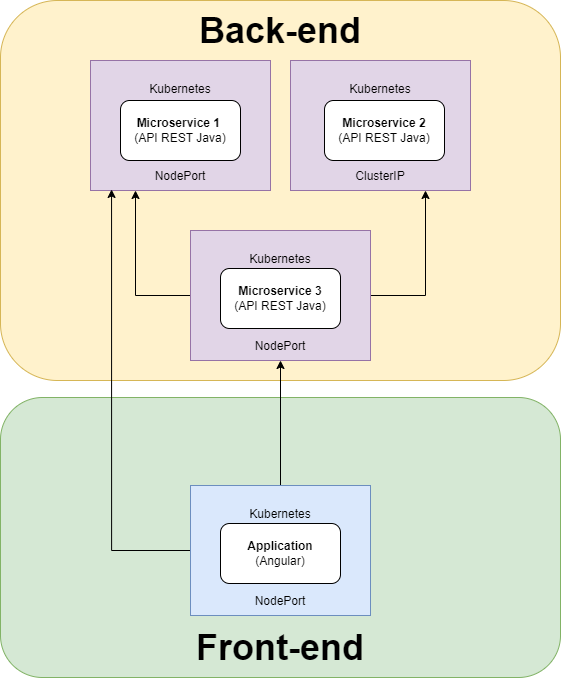
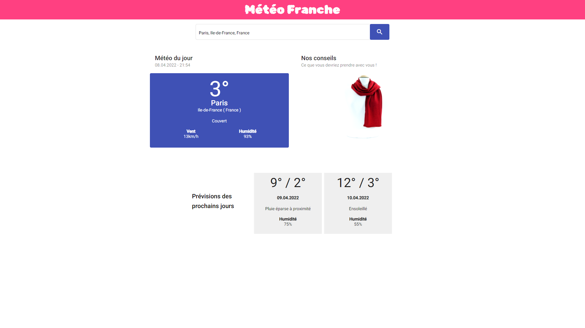
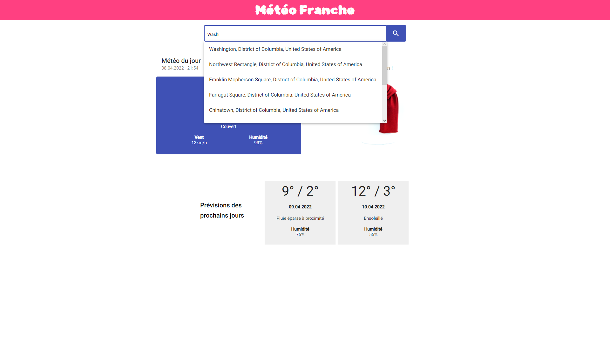
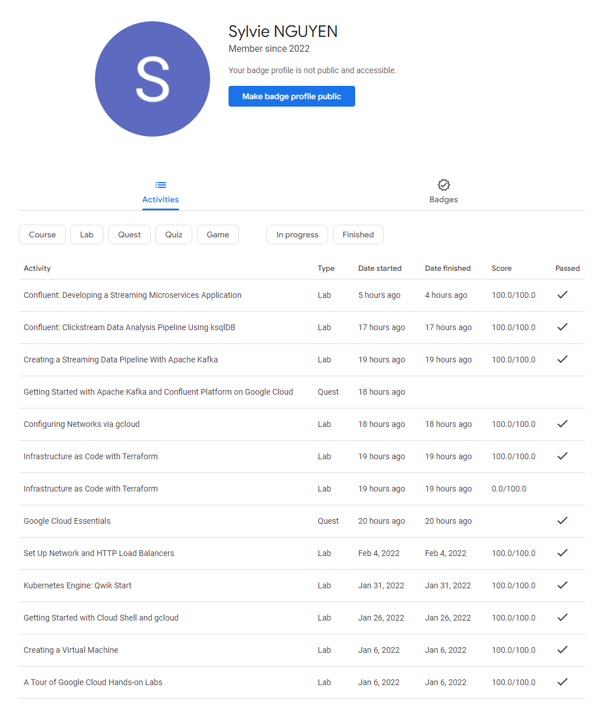
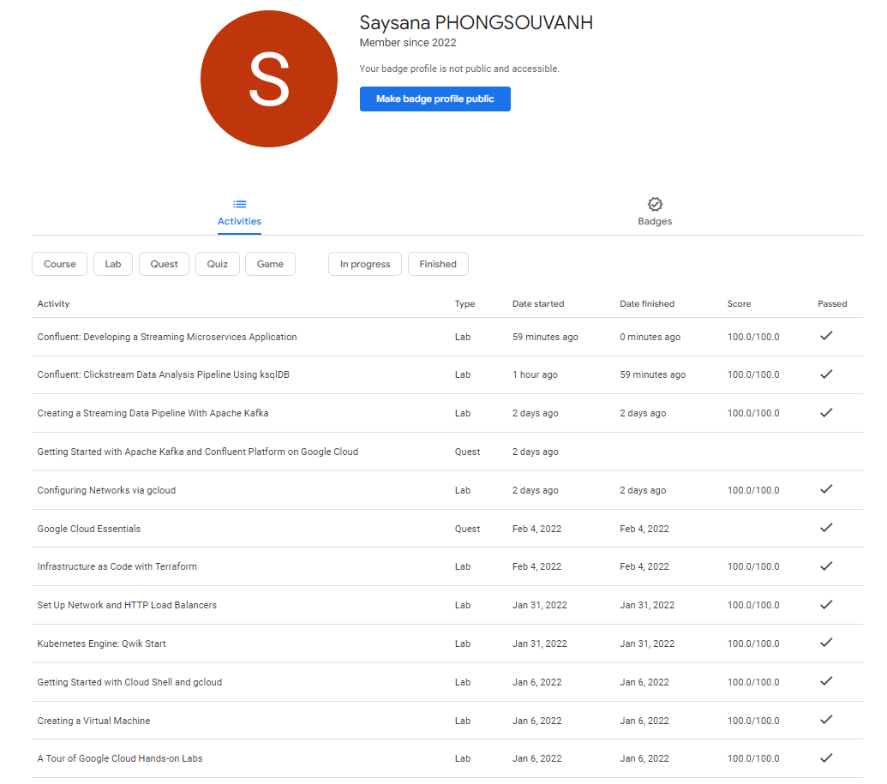

# 5I_SY3 : Projet de virtualisation
**2021/2022 - ESIEE Paris**  

Sylvie NGUYEN - [sylvie.nguyen@edu.esiee.fr](mailto:sylvie.nguyen@edu.esiee.fr)  
Saysana PHONGSOUVANH - [saysana.phongsouvanh@edu.esiee.fr](mailto:saysana.phongsouvanh@edu.esiee.fr)

## Environnement de développement
- **Minikube:** v1.25.1
- **Kubernetes (kubectl):** v1.22.5 (client) & v.1.23.1 (server)
- **Angular CLI:** v13.2.6
- **Node:** v16.14.0
- **Package Manager:** npm v8.3.0
- **Docker:** v20.10.12
- **Java:** JDK 11

---

## Présentation du projet
Notre projet est une application web qui donne des informations sur la météo suivant une 
position donnée. On peut obtenir la température, la condition météorologique, la vitesse du vent
et le taux d’humidité. 
Grâce à ces informations sur la météo, nous proposons des accessoires à prendre avec soi en 
fonction du temps. De plus, il y a une prévision de la condition météorologique des deux 
prochains jours avec la température maximale et minimale.  

---
## Architecture de l'application



### Back-end de l’application
La partie back-end de l’application est basée sur une **architecture microservices**. 
Elle se compose de **trois microservices** développées avec **Java/Spring Boot**, chacun ayant une utilité spécifique :

- Le **microservice n°1** permet d’obtenir des informations sur la météo en fonction de la position donnée. Pour cela, on fait appel à l’API libre d’utilisation, **Weather API**.
- Le **microservice n°2** permet d’effectuer une requête sur le moteur de recherche **Qwant** afin d’obtenir une image.
- Le **microservice n°3** fait appel quant à lui au microservice n°1 et n°2 afin de donner un conseil à l’utilisateur quant aux accessoires à prendre en fonction de la météo.

Les microservices sont construits par le biais de scripts **Gradle**.

### Front-end de l’application
Le front-end a été développé avec le framework **Angular**. 
Il fait appel au microservice 1 pour afficher la météo et au microservice 3 pour les conseils vestimentaires. La position est saisissable grâce à un champ de texte avec de l’autocomplétion.
Pour le style, nous avons utilisé la librairie **Angular Material**.

### Déploiement
Les trois microservices ainsi que l'application web 
sont conteneurisés avec **Docker** sur le docker hub aux adressses suivantes :
- https://hub.docker.com/repository/docker/phongsos/microserv1
- https://hub.docker.com/repository/docker/phongsos/microserv2
- https://hub.docker.com/repository/docker/phongsos/microserv3
- https://hub.docker.com/repository/docker/phongsos/front-end

Le déploiement des différents conteneurs se fait grâce à Kubernetes (k8s), 
et plus précisément Minikube (k3s), pour cela un fichier est disponible : `project-app.yml`.

Seuls les **microservices 1 et 3** sont exposés à l'extérieur en tant que **NodePort**, tout comme l'application Angular.

---

## Exécution
Il est nécessaire de lancer Minikube avec la commande suivante afin d'ouvrir les ports de nos services. 
Il s'agit d'un contournement d'un bug rencontré avec notre version de Minikube sous Windows 10 : https://stackoverflow.com/questions/71384252/cannot-access-deployed-services-when-minikube-cluster-is-installed-in-wsl2

```bash
minikube delete # Pour supprimer le profil minikube existant
minikube start --driver=docker --ports=127.0.0.1:31000:31000,127.0.0.1:31001:31001,127.0.0.1:31002:31002
```

Ensuite, à la racine du projet, il faut appliquer notre yaml afin de déployer notre application :
```bash
kubectl apply -f project-app.yml
```

Il est possible que le démarrage des ports 31000, 31001 et 31003 prenne plusieurs minutes.

Le front-end de l'application est alors accessible depuis l'adresse `http://localhost:31000` 
tandis que deux microservices sont accessibles via les adresses `http://localhost:31001` et `http://localhost:31002`.

### Autres commandes utiles
**Pour supprimer les pods et les services crées :** 
```bash
kubectl delete deployment.apps/front-end-deployment deployment.apps/microserv1-deployment deployment.apps/microserv2-deployment deployment.apps/microserv3-deployment service/front-end-service service/microserv1-service service/microserv2-service service/microserv3-service
```

**Procédure pour déployer une nouvelle image d'un microservice dans le docker hub :**  
(Exemple pour le microservice 1)
```bash
cd microserv1
./gradlew build
docker images # -> récupérer l'ID de l'image microserv1
docker rmi -f IMAGE_ID
docker build -t microserv1 .
docker images # -> récupéer la nouvelle ID de l'image microserv1
docker tag IMAGE_ID phongsos/microserv1:1
docker push phongsos/microserv1:1
```

**Procédure pour déployer une nouvelle image du front-end dans le docker hub :**
```bash
cd front-end
ng build
docker images # -> récupérer l'ID de l'image microserv1
docker rmi -f IMAGE_ID
docker build -t front-end .
docker images # -> récupéer la nouvelle ID de l'image microserv1
docker tag IMAGE_ID phongsos/front-end:1
docker push phongsos/front-end:1
```

---

## Screenshots de l'application




---

## Qwiklabs


